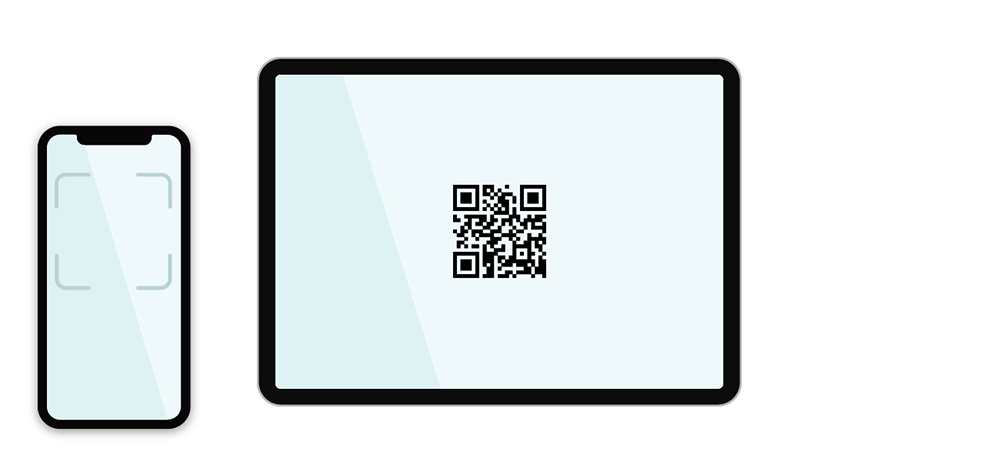
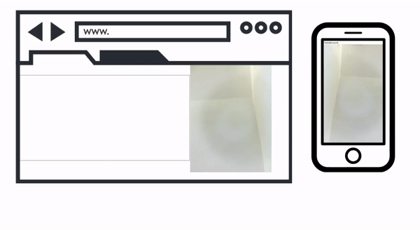

# WebRTC Smartphone Controller #

## Table of contents ##
  * [How it works](#how-it-works)
    + [1. Open the website](#1-open-the-website)
    + [2. Scan the QRcode](#2-scan-the-qrcode)
    + [3. Control the website](#3-control-the-website)
  * [Demos](#demos)
    + [Tiny Platformer](#tiny-platformer)
    + [3D racing](#3d-racing)
    + [Physics simulator](#physics-simulator)
    + [Multiplayer Physics simulator](#multiplayer-physics-simulator)
    + [Handtracking](#handtracking)

## Tools ##
The main tool to make a peer-to-peer connection is [Peerjs](https://peerjs.com/), [WebRTC](https://webrtc.org/).
To generate QRcodes with custom Urls [Qrcodejs](https://davidshimjs.github.io/qrcodejs/) was used.
Other tools to create the demos themselves are [Matterjs](https://brm.io/matter-js/) for physics simulation, [Nipplejs](https://yoannmoi.net/nipplejs/) joystick and [Handpose](https://github.com/tensorflow/tfjs-models/tree/master/handpose) for handtracking. 

## How it works ##

The whole process requires only 3 steps:

### 1. Open the website ###
Navigate to the PC side website. This will create a peer listening for connection and show a QRcode with a unique ID. 

### 2. Scan the QRcode ###
Scan the QRcode with your smartphone. Two websites communicate by eastablishing peer to peer connection. The QRcode will provide all necessary details for the phone to connect to the PC.

### 3. Control the website ###
After opening the QRcode URL you are ready to use your smartphone as a controller. No extra installation required. The smartphone browser will package your input and send it to the PC browser which will process it and turn it into real actions.

## Demos ##

### Tiny Platformer ###
Tiny platformer game with NES controller. Collect the gold coins and jump on the enemies to beat the level.  
Try the [tiny platformer](https://emmapoliakova.github.io/WebRTCSmartphoneController/demo/tinyPlatformer/index.html)

### 3D racing ###
3D racing game controlled with phone joystick. Use the joystick to steer, brake and jump. How many points can you score before the time runs out?  
Try the [3D Racer](https://emmapoliakova.github.io/WebRTCSmartphoneController/demo/3dRacing.html)

### Physics simulator ###
A physics simulator created with Matterjs. Use the touchpad to select and stack blocks.  
Try the [physics simulator](https://emmapoliakova.github.io/WebRTCSmartphoneController/physics/physicsDemoV3.html)

### Multiplayer Physics simulator ###
Multiplayer tower building. This demo requires two people to connect. Both players will need to cooperate by selecting the same block to be able to carry it.  
Try the [cooperative physics simulator](https://JeherillaJanwar.github.io/WebRTCSmartphoneController/physics/physicsDemoV4.html)

### Handtracking ###
This demo lets you stream a video into browers that will track your hand to control the dot. 
Try the [hand tracking](https://JeherillaJanwar.github.io/WebRTCSmartphoneController/handtracking/receiveVideo.html)

